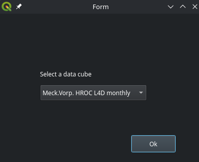
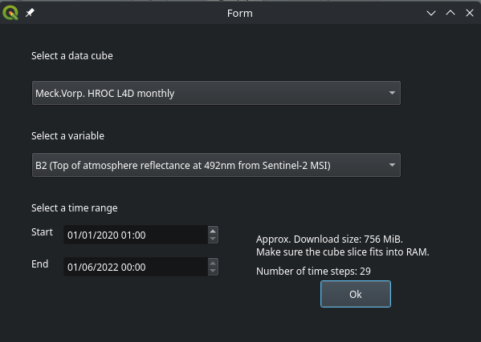
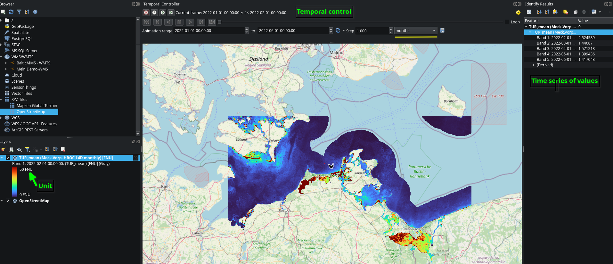
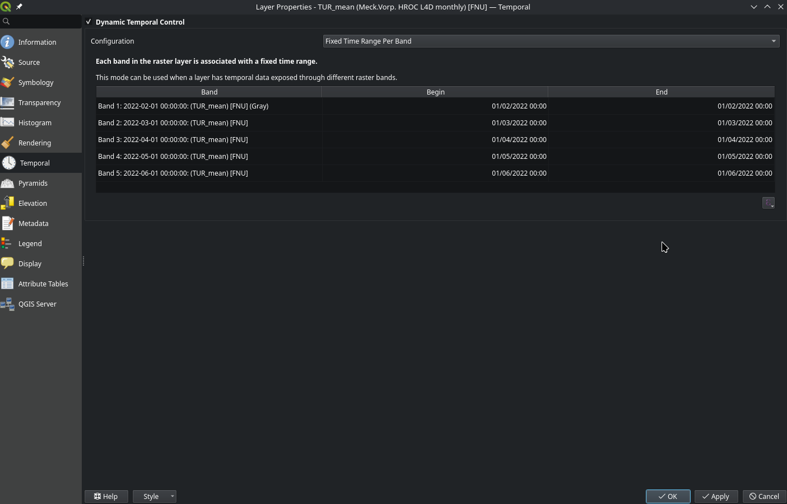

# BalticAIMS QGIS plugin

A plugin for [QGIS](https://qgis.org/) to load [Xcube](https://github.com/xcube-dev/xcube) data cubes from an xcube server.
The plugin is being developed for ESA's [BalticAIMS](https://eo4society.esa.int/projects/balticaims/) project.

QGIS is a free and open-source geographic information system (GIS) software
used for visualizing and editing geospatial data in a variety of raster and
vector formats. QGIS provides a Python plugin infrastructure that can be used
to add additional processing functionality or control and extend the graphical
user interface. The QGIS documentation page provides a 
[User Guide](https://docs.qgis.org/3.44/en/docs/user_manual/) for general
usage of QGIS and a Plugin Development Guide for developing Python plugins.

The BalticAIMS QGIS plugin enables QGIS users to visualize and analyze the
spatiotemporal data cubes located in S3 storage from the QGIS environment that
they are familiar with. The same datasets may be inspected using the
[xcube viewer page](https://viewer.balticaims.eu/) for BalticAIMS.

The plugin itself provides “actions”, which are menu entries under the
“Plugins” main menu, that can be used to select data to load into QGIS.
The data of one variable is represented as a Raster Layer in
the same way e.g. a GeoTIFF file would be, enabling users to analyze it with
standard QGIS functions. The functionality of the plugin encompasses loading
data from S3 and annotating it with the correct metadata to integrate with
built-in QGIS features. Data analysis is left to built-in tools and other
plugins.

> [!IMPORTANT]
> The plugin is still experimental, please have a look at the [Limitations](#limitations) section.

## Contents

- [BalticAIMS QGIS plugin](<#balticaims-qgis-plugin>)
    - [Contents](<#contents>)
    - [Concepts](<#concepts>)
        - [Data Cubes](<#data-cubes>)
    - [Installation](<#installation>)
        - [Windows](<#windows>)
            - [Steps](<#steps>)
        - [Notes](<#notes>)
    - [Usage](<#usage>)
        - [Features](<#features>)
        - [Loading Data](<#loading-data>)
        - [The interface](<#the-interface>)
        - [Temporal Control](<#temporal-control>)
    - [Limitations](<#limitations>)

## Concepts

### Data Cubes

Unlike a traditional raster data set which represents a physical quantity for a
single time frame, data cubes often represent data for many time steps in a
time series. The plugin represents time series data as a single raster layer
with one band per time step. The concept of a “variable” in a data cube is
represented as a Layer in QGIS whereas the “band” concept is used to
represent time steps. With this mapping, datasets with dense time series can be
represented without overcrowding the Layers Panel. However, it is important to
keep these concepts separated to avoid confusion between “band” and
“variable”.

## Installation

### Windows

The Plugin relies on the [Xcube](https://github.com/xcube-dev/xcube) Python package, which is not distributed with the plugin.

In order to use the BalticAIMS QGIS plugin, the Python virtual environment, including Xcube, must be installed and configured for QGIS to use.

On Windows, you can use the install scripts provided with the release, to:

1) setup the environment (`setup.bat`), done only once on installation
2) run the QGIS version configured with the correct Python virtual environment (`run_qgis_with_xcube.bat`), every time you want to use the plugin
.

After the setup has been completed, you can install the plugin  using "Install from Zip" in the [QGIS Plugin Manager](https://docs.qgis.org/3.40/en/docs/training_manual/qgis_plugins/fetching_plugins.html). Simply select the plugin `balticaims.<version>.zip` zip file in the dialog, which is contained in the release archive together with the installation scripts.
Please make sure to not select the release archive (which you can download from this repository), but the QGIS plugin zip `balticaims.<version>.zip`, which is contained in the release archive and can be accessed after unzipping the archive.

#### Steps

1) Download the relase to the directory where you would like to install the Python environment
2) Unzip the archive
3) Run (by double click) the `setup.bat` script to install the Python environment. This will take several minutes. Please be aware that the script will not produce text output for a few minutes shortly after launch. Please be patient!
4) Run (double click) the `run_qgis_with_xcube.bat` script to launch QGIS. QGIS' Python interpreter should now be configured to support the plugin
5) Install the plugin using QGIS' Plugin Manager, if you didn't already

### Notes

- If the plugin is installed, you may encounter an error when launching QGIS normally, without running `run_qgis_with_xcube.bat`. You can ignore this error, but the plugin will not work.
- You can verify that the Python environment is configured correctly, by opening the [Python Console](https://docs.qgis.org/3.40/en/docs/user_manual/plugins/python_console.html) in QGIS and running `import xcube`. If no error is thrown, the environment is working correctly.
- The scripts `setup.bat` and `run_qgis_with_xcube.bat` must remain next to the other files distributed with the release and created by running `setup.bat`. Do not move the scripts to another location, or they will stop working. You can create a Desktop shortcut, if you wish.

## Usage

### Features

- Load data hosted by the [BalticAIMS xcube server](https://xcube.balticaims.eu/api/datasets) directly into QGIS.
  Each variable appears as a layer with bands representing the time dimension
- Annotates layers with temporal information. Use QGIS' built-in
  [Temporal Controller](https://docs.qgis.org/3.44/en/docs/user_manual/map_views/map_view.html#the-temporal-controller-panel) to step through
- Sets up a default symbology with reasonable limits

### Loading Data

The plugin loads data in two steps, which are shown as an action each, in the 
main menu. On a higher level, BalticAIMS provides data cubes in an S3 bucket. 
The plugin adds an action “Add Datacube” listing the available cubes and 
allows the user to add one to the selection of open cubes. At this first stage, 
no data is downloaded yet; the action merely makes the plugin aware of the 
metadata of the cube of interest.

*select a data cube*

The second action, “Load layer”, allows users to select any variable from 
the data cubes previously opened using “Add data cube” to download and 
visualize. After the download is complete, the newly created 
layer appears in the Layers Panel.  

*load a data layer*

### The interface

The loaded data appears in the Layers panel on the bottom left.
The layer name indicates the variable, the data cube it is taken from and the unit of measurement.
The raster values can be inspected with the 
[Identify Features](https://docs.qgis.org/3.44/en/docs/user_manual/introduction/general_tools.html#identify)
tool (values are shown on the right).
Use the 
[Temporal Controller](https://docs.qgis.org/3.44/en/docs/user_manual/map_views/map_view.html#the-temporal-controller-panel)
to step through the time series.

*overview of features*

### Temporal Control

Each band in the layer is annotated with the starting date of the time range it represents.
This annotation has been chosen, because of a bug in the QGIS temporal controller, which
causes problems in the visualization if the bands are annotated with the full time range, i.e. a
monthly product having "Begin" set to the first of the month and "End" set to the last of the month.

*Temporal annotation*

To correctly visualize all time steps, set the temporal controller to *Animated temporal navigation*, step the Animation
range back by one unit and set the step matching your data cube, e.g. to *months* for a monthly product.

> [!TIP]
> If you do not see any data after enabling temporal control, make sure the step is set in such a way that 
> the date set for the band (for example, the first of the month) is included in the range.
> If the step is set to monthly, a monthly product should always show data if the time frame is inside
> the temporal bounds of the data cube.

## Limitations

- The selected (time) slice of the data cube is downloaded into memory. This limits the plugin to sufficiently small
  data cubes. Please double check the estimated download size in the layer selection interface to make sure the data
  will fit into RAM.
- Data cube layers will not reopen if a project is closed and reopened. For now, it is necessary to manually open
  these layers again.

> [!INFORMATION]
> These limitations may be well addressed by native Zarr support coming to QGIS in the near future.
